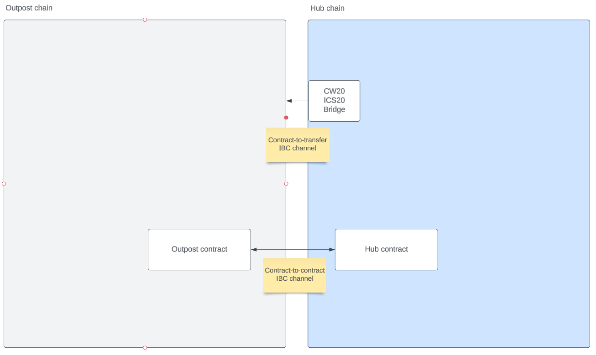
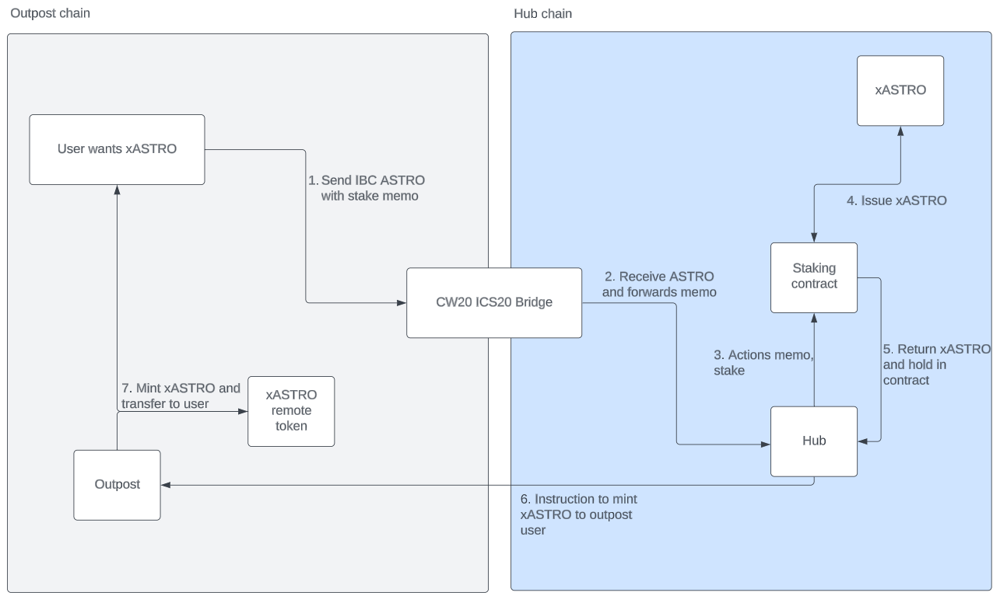
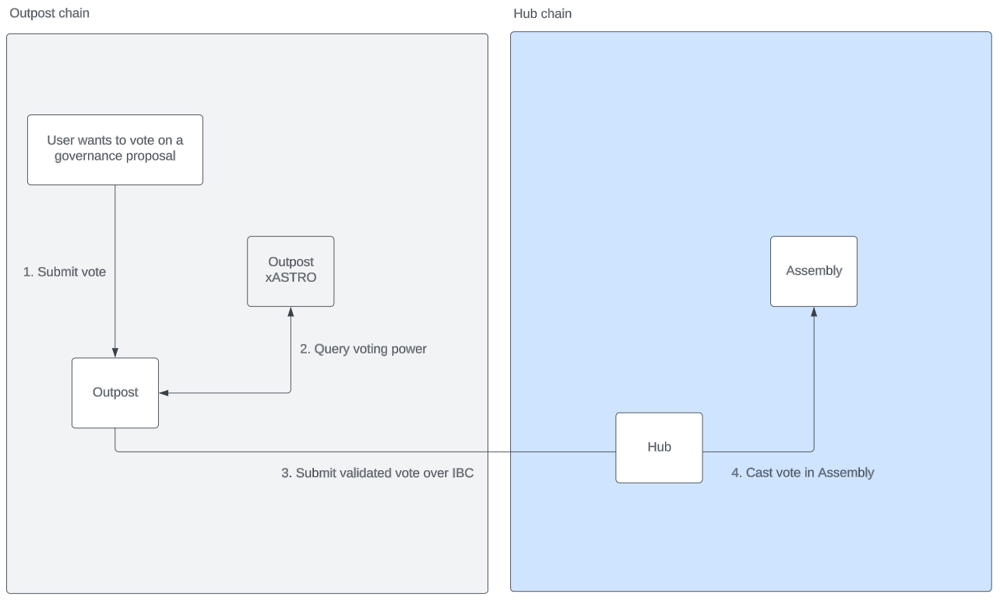
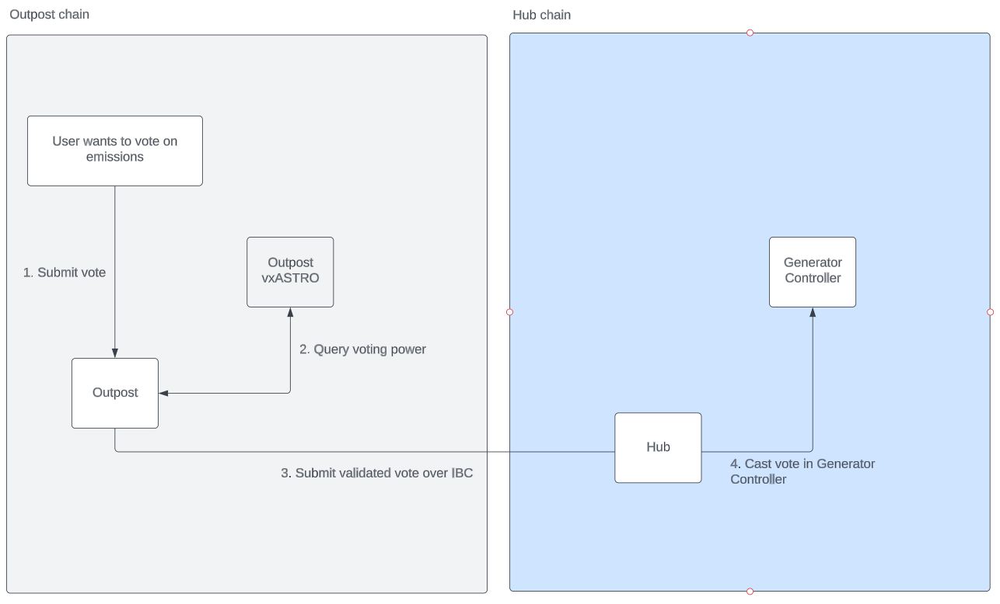
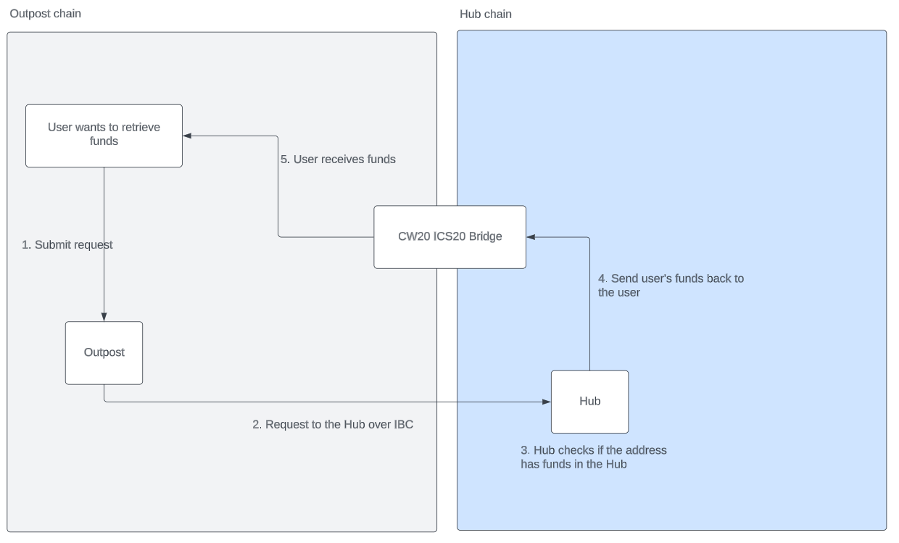
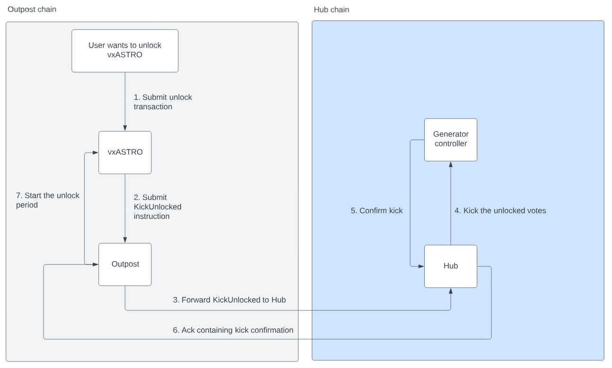

# Interchain governance

To enable interchain governance from any Outpost, we deploy two contracts. The Hub contract on the Hub chain and the Outpost contract on the Outpost chain. The Hub chain is defined as the chain where Assembly and the ASTRO token is deployed.

This enables the following actions:

1. Stake ASTRO
2. Unstake xASTRO
3. Vote in governance
4. Vote on emissions through vxASTRO

This document covers the flow of messages, permissioned IBC channels and how failures are handled to make this as safe as possible for a user as well as the protocol itself.

## Architecture

To enable interchain governance, the following contracts need to be deployed:

### Hub

1. Hub
2. CW20-ICS20 with memo handler support
3. Assembly
4. ASTRO token
5. Staking
6. xASTRO token
7. Generator Controller
8. vxASTRO

Technical details on the Hub is available [in this document](contracts/hub/README.md).

### Outpost

1. Outpost
2. Outpost xASTRO with timestamp balance tracking
3. vxASTRO

Technical details on the Outpost is available [in this document](contracts/outpost/README.md).

### IBC

The following diagram shows the IBC connections between these contracts: 

*IBC connections diagram*

The CW20-ICS20 contract allows CW20 tokens to be transferred to other chains where they end up as standard IBC tokens. This requires a contract-to-transfer channel, that is, a channel between the contract port `wasm.wasm12345...` and the counterparty chain's `transfer` port.

The Hub and Outpost requires a contract-to-contract channel, that is, a channel between the Hub contract port `wasm.wasm123hub45...` and the Outpost's contract port `wasm.wasm123outpost45...`. Both contracts contain configuration parameters that will **only** allow these two contracts to communicate - it is not possible to send messages to either contract outside of this secured channel.

Do note that the Hub may have multiple Outposts configured at any time, but the Outpost may only have a single Hub configured.

## Flow of messages

### Prerequisite IBC knowledge

1. In an IBC transfer (or sending of a message) the initial transaction might succeed on the source chain but never make it to the destination resulting in a timeout. 

2. When an IBC message is received by the destination, they reply with an acknowledgement message. This may indicate success or failure on the destination side and may be handled by the source.

### Staking ASTRO from an Outpost

> xASTRO on an Outpost is using a custom CW20 contract that tracks balances by timestamp instead of sending the tokens over IBC. We require this to verify xASTRO holdings at the time a proposal was created to vote in governance.

In order to stake ASTRO from an Outpost, the user must meet the following conditions:

1. ASTRO tokens transferred over the official CW20-ICS20 channel

*Stake ASTRO from an Outpost*

The flow is as follows:

1. A user sends IBC ASTRO to the chain's IBC `transfer` channel with a memo indicating they want to stake the tokens. See [the Hub's messages for details](contracts/hub/README.md)
2. The CW20-ICS20 contract forwards the ASTRO and memo to the Hub contract
3. For staking, sends the ASTRO to the staking contract
4. xASTRO is minted
5. xASTRO is sent back to the Hub contract
6. Issue an Outpost IBC message to mint the corresponding amount of xASTRO on the Outpost
7. The Outpost contract mints the xASTRO to the original sender's address

Failure scenarios and how they are handled:

1. Initial IBC transfer fails or experiences a timeout
    
    The funds are returned to the user by the CW20-ICS20 contract

2. Handling the memo, ASTRO staking, xASTRO minting or Outpost minting message fails

    The entire flow is reverted and the ASTRO is sent back to the user by the CW20-ICS20 contract

3. Minting of xASTRO on Outpost fails or experiences a timeout

    The staked xASTRO is unstaked and the resulting ASTRO is sent back to the initial staker.

4. IBC transfer of ASTRO back to the user succeeds, but experiences a timeout or transfer fails

    The ASTRO is sent back to the Hub contract together with the intended recipient of the funds. The Hub will hold these funds on behalf of the user, but exposes a path to allow the retry/withdrawal of the funds. The funds are **not** lost.

 
### Voting in governance from an Outpost

In order to vote in governance from an Outpost, the user must meet the following conditions:

1. xASTRO tokens on the Outpost
2. The xASTRO tokens must have been held at the time the proposal was created

*Vote in governance from an Outpost*

The flow is as follows:

1. A user submits a vote to the Outpost contract. See [the Outpost's messages for details](contracts/outpost/README.md)
2. The Outpost checks the voting power of the user at the time of proposal creation by doing three things
    * If the proposal is cached already, use the timestamp. If not, query the Hub for the proposal information
    * Query the xASTRO contract for the user's holdings at the proposal creation time
    * Query the vxASTRO contract for the user's xASTRO deposits at the proposal creation time
3. Submit vote with voting power to the Hub
4. Hub casts the vote in the Assembly on behalf of the user

Failure scenarios and how they are handled:

1. Initial vote fails or experiences a timeout
    
    An error is returned in the contract and written as attributes

2. Casting of vote on Hub or Assembly fails

    An error is returned in the contract and written as attributes

### Voting on emissions from an Outpost (vxASTRO)

In order to vote on emissions from an Outpost, the user must meet the following conditions:

1. xASTRO tokens locked in the vxASTRO contract on the Outpost

*Vote on emissions from an Outpost*

The flow is as follows:

1. A user submits a vote to the Outpost contract. See [the Outpost's messages for details](contracts/outpost/README.md)
2. The Outpost checks the current voting power of the user by querying the vxASTRO contract
3. Submit vote with voting power to the Hub
4. Hub casts the vote in the Generator Controller on behalf of the user

Failure scenarios and how they are handled:

1. Initial vote fails or experiences a timeout
    
    An error is returned in the contract and written as attributes

2. Casting of vote on Hub or Generator Controller fails

    An error is returned in the contract and written as attributes

### Withdraw funds from the Hub

In order to withdraw funds from the Hub, the user must meet the following conditions:

1. The user must have ASTRO stuck on the Hub

*Withdraw funds from the Hub*

The flow is as follows:

1. A user submits a request for withdrawal to the Outpost contract. See [the Outpost's messages for details](contracts/outpost/README.md)
2. The Outpost sends the request to the Hub over IBC
3. Hub checks if the original sender on the Outpost has funds
4. If the user has funds, send _everything_ to the user through the CW20-ICS20 contract
5. User receives IBC funds

Failure scenarios and how they are handled:

1. Initial request fails or experiences a timeout

    An error is returned in the contract and written as attributes

2. Checking for funds fails or the user has no funds on the Hub

    An error is returned in the contract and written as attributes

2. The transfer of funds fail or experiences a timeout

    The funds are returned to the Hub contract and captured against the original sender's address again

### Unlock vxASTRO on Outpost

When vxASTRO is unlocked, the votes cast by the user previously need to be removed from the Generator controller on the Hub. 

*Unlock on Outpost*

The flow is as follows:

1. Submit the unlock to the vxASTRO contract
2. The unlock will be processed and the kick message sent to the Outpost
3. The Outpost will forward the unlock the the Hub
4. The Hub will execute the kick on the Generator controller
5. When the votes have been removed, the confirmation is returned to the Hub
6. The Hub writes back the IBC acknowledgement containing the success
7. The Outpost receives the IBC acknowledgement and starts the actual unlock period on vxASTRO

Failure scenarios and how they are handled:

1. Initial request fails or experiences a timeout

    An error is returned in the contract and written as attributes

2. Failing to remove votes

    An error IBC acknowledgement is returned and the vxASTRO does not start unlocking
