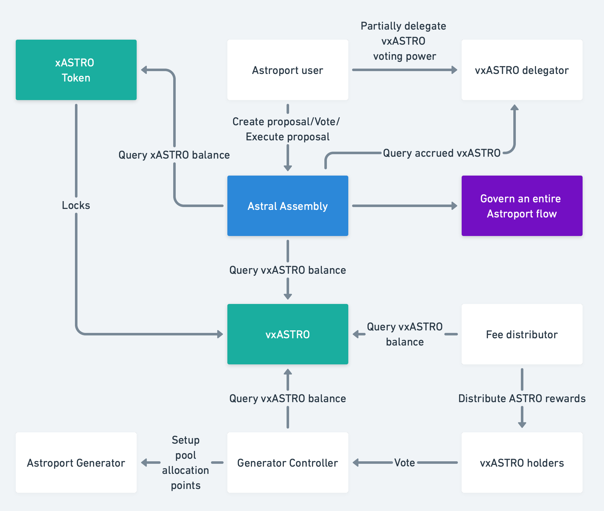

# Astroport Governance

[](https://codecov.io/gh/astroport-fi/astroport-governance)

This repo contains Astroport Governance related contracts.

## Contracts diagram



## Contracts

| Name                           | Description                      |
| ------------------------------ | -------------------------------- |
| [`assembly`](contracts/assembly) | The Astral Assembly governance contract |
| [`builder_unlock`](contracts/builder_unlock) | ASTRO unlock/vesting contract for Initial Builders |
| [`escrow_fee_distributor`](contracts/escrow_fee_distributor) | vxASTRO fee distributor |
| [`generator_controller`](contracts/generator_controller) | Generator Controller used to vote on directing ASTRO emissions |
| [`voting_escrow`](contracts/voting_escrow) | vxASTRO contract |

## Building Contracts

You will need Rust 1.64.0+ with wasm32-unknown-unknown target installed.

### You can compile each contract:
Go to contract directory and run 
    
```
cargo wasm
cp ../../target/wasm32-unknown-unknown/release/astroport_token.wasm .
ls -l astroport_token.wasm
sha256sum astroport_token.wasm
```

### You can run tests for all contracts
Run the following from the repository root

```
cargo test
```

### For a production-ready (compressed) build:
Run the following from the repository root

```
./scripts/build_release.sh
```

The optimized contracts are generated in the artifacts/ directory.

## Branches

We use [main](https://github.com/astroport-fi/astroport-governance/tree/main) branch for new feature development and [release](https://github.com/astroport-fi/astroport-governance/tree/release) one for collecting features which are ready for deployment. You can find the version and commit for actually deployed contracts [here](https://github.com/astroport-fi/astroport-changelog).

## Docs

Docs can be generated using `cargo doc --no-deps`

## Bug Bounty

The contracts in this repo are included in a [bug bounty program](https://www.immunefi.com/bounty/astroport).
