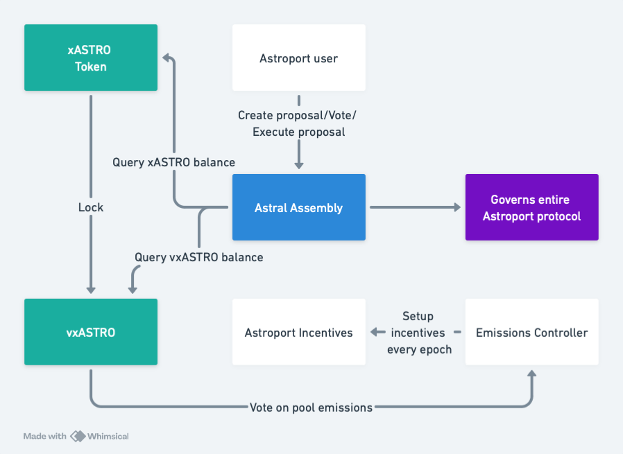

# Astroport Governance

[](https://codecov.io/gh/astroport-fi/astroport-governance)

This repo contains Astroport Governance related contracts.

## Contracts diagram



## Contracts

| Name                           | Description                      |
| ------------------------------ | -------------------------------- |
| [`assembly`](contracts/assembly) | The Astral Assembly governance contract |
| [`builder_unlock`](contracts/builder_unlock) | ASTRO unlock/vesting contract for Initial Builders |
| [`escrow_fee_distributor`](contracts/escrow_fee_distributor) | vxASTRO fee distributor |
| [`generator_controller`](contracts/generator_controller) | Generator Controller used to vote on directing ASTRO emissions |
| [`voting_escrow`](contracts/voting_escrow) | vxASTRO contract |

## Building Contracts

You will need Rust 1.58.1+ with wasm32-unknown-unknown target installed.

You can run unit tests for each contract directory via:

```
cargo test
```

#### For a production-ready (compressed) build:
Run the following from the repository root

```
./scripts/build_release.sh
```

The optimized contracts are generated in the artifacts/ directory.

## Branches

We use [main](https://github.com/astroport-fi/astroport-governance/tree/main) branch for new features development whereas [release/terra1](https://github.com/astroport-fi/astroport-governance/tree/release/terra1) and [release/terra2](https://github.com/astroport-fi/astroport-governance/tree/release/terra2) branches are for stable releases.
You can find actual deployed code in release/* branches.
