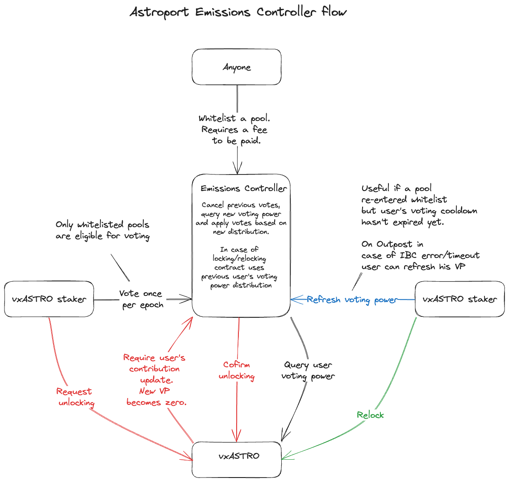
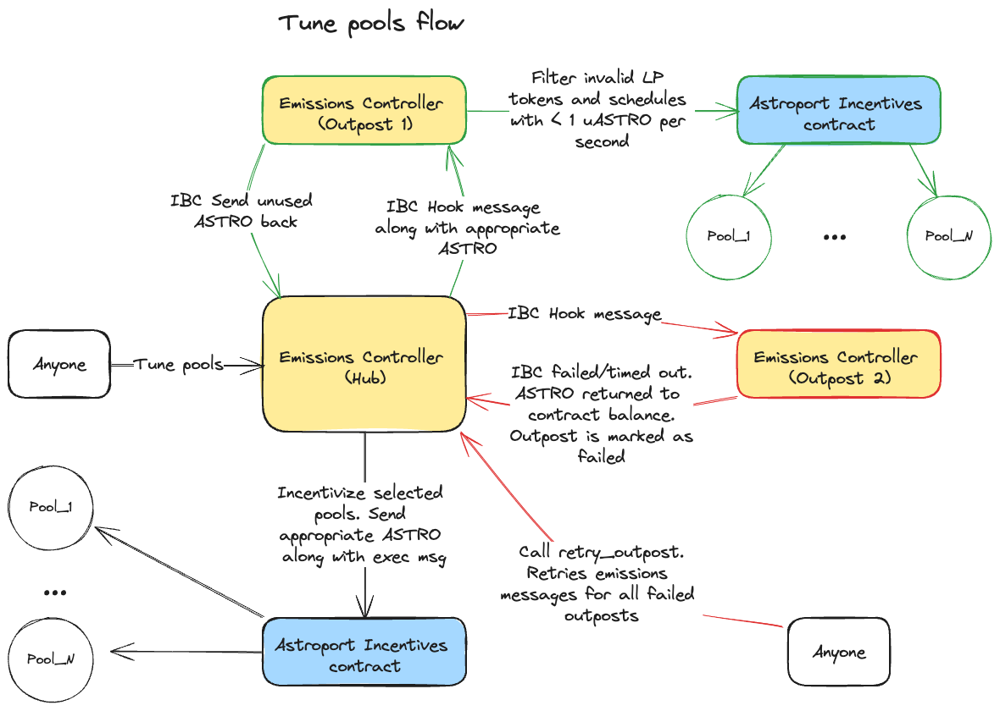

# Emissions Controller (Hub)

The Emissions Controller allows vxASTRO holders to vote on ASTRO emissions.
This Hub's contract is responsible for collecting votes from vxASTRO stakers from all outposts
and calculating the final ASTRO emissions every epoch.
Epoch lasts 2 weeks and always starts on Monday 00:00 UTC.
Total ASTRO emissions every epoch are based on two-epoch Exponential Moving Average (EMA) of the total collected ASTRO
to ASTRO staking contract (i.e. ASTRO buybacks).



## Pool whitelisting

The Emissions Controller accepts votes only for whitelisted pools.
Whitelisting is permissionless but requires a fee to be paid.
Anyone can whitelist a pool which respects to registered outpost.
If the pool is located on the Hub contract also checks, this LP token corresponds to the pool in the factory.

## Voting

Users are required to have vxASTRO to cast their votes.
They can vote for up to five whitelisted pools at once every 10 days.
After voting, they can't change their votes until the cooldown period ends.
Executable message accepts an array of tuples with LP token and vote weight.
Vote weight is a number between 0 and 1. Total vote weight can't exceed 1.
If user doesn't vote during the next epochs, their contribution stays intact.

## vxASTRO changes

If a user locks or unlocks vxASTRO, the changes are reflected in the Emissions Controller.
The contract updates their voting power based on their previous weight distribution.
For example, user with 100 voting power voted `[(pool1, 0.5), (pool2, 0.5)]`.
Their initial contribution would be 50 to pool1 and 50 to pool2.
If they lock 100 more vxASTRO, their new voting power would be 200 and their contribution to pool1 and pool2 would be
100 each.
If a user requests to unlock vxASTRO, their contribution will be removed from both pools.

## ASTRO dynamic emissions curve

Total ASTRO emissions are derived based on two-epoch EMAs of the total collected ASTRO to
ASTRO staking contract (xASTRO).
Two-epochs EMA is calculated by the following formula:

```
(V_n-1 * 2/ 3 + EMA_n-1 * 1/ 3)
```

where V_n is the collected ASTRO at epoch n, n is the current epoch (a starting one).  
Dynamic emissions formula is:

```
next emissions = MAX(MIN(max_astro, V_n-1 * emissions_multiple), MIN(max_astro, two-epochs EMA))
```

Emissions are capped to `max_astro` which is part of contract state.
`emissions_multiple` constant controls the ASTRO inflation rate.
`max_astro` is expected to be set to 1.4M ASTRO per epoch on vxASTRO launch and `emissions_multiple` is expected to be
0.8.
Both `max_astro` and `emissions_multiple` can be changed by governance later on.

Since this formula is recursive, the contract requires accurate EMA and collected ASTRO values from previous epoch prior
contract instantiation.

## Emissions distribution

We call the process of ASTRO emission distribution `tuning`.
Tuning endpoint is permissionless and has 2-week cooldown.
During tuning contract queries snapshotted votes per pool at the exact start of the epoch
(Monday 00:00 UTC starting from Mon May 20 00:00:00 UTC 2024).
Then it filters out pools which are not part of any outpost, sorts pools by votes and
takes top X pools, where X - 'config.pools_per_outpost' * number of outposts.
At the time when this endpoint is executed, new dynamic ASTRO emissions are calculated.
Then the contract distributes ASTRO to the selected pools based on their share of
**total voting power of selected pools** from the previous step.
Based on whether outpost is the Hub or remote Astroport deployment, the contract sends ASTRO along with an executable
message to the Astroport Incentives contract or IBC Hook to remote Emissions Controller respectively.
We approximate `config.pools_per_outpost` as 5 on vxASTRO launch, however, it can be changed by governance later on.

Note, that receiving outpost **must** implement IBC hooks to have the whole process working in one go.
At the time of writing, Astroport has one outpost (Sei chain) which doesn't support it and requires manual intervention
by Builders multisig.

In the diagram below, several scenarios are presented.
Black arrows represent the flow on the Hub, green arrows represent
successful IBC transfer to the remote outpost with possible filtered invalid LP tokens, red arrows represent failed IBC
transfer to the remote outpost
followed by permissionless `retry_failed_outposts` call.



## IBC failures

Thanks to Neutron Integrated Apps support, it allows handling timeouts and failures of ICS20 packets.
After the tunning, contract processes IBC callbacks and marks outposts as done or failed depending on the
result.
If any of outposts failed anyone can call `retry_failed_outposts` endpoint to retry the failed outposts.
Note that if those outposts haven't been retried during the epoch, their state will be cleared on the next epoch.

## Maintaining Whitelist Presence

Due to security reasons we introduced special parameter `config.whitelist_threshold` which is expected to be 0.01 (1% of
all votes).
Every epoch during tuning the contract removes all pools that have less than `config.whitelist_threshold` of total
votes.
Those pools will need to be whitelisted again, and their voting process starts from scratch.
Users who voted for
removed pools will need to vote again or to re-apply their votes via special `refresh_user_votes` endpoint with no
cooldown.

## ASTRO pools

Each outpost may or may not have an ASTRO pool which needs to be incentivized with flat emissions.
Those pools can't be voted on, and they receive emissions out of the dynamic emissions curve.

## Emissions Controller balance

Astroport governance must maintain contract's ASTRO and NTRN balance.
ASTRO is used for emission distribution and NTRN is used for IBC fees.
It is expected that governance will top up the contract with ASTRO upfront for the next year.
At the time of writing, Neutron requires 0.2 NTRN per IBC transfer while 0.1 out of 0.2 is sent back to the contract.
So generally, it is expected that the contract has 0.2 * number of outposts NTRN balance every epoch.

## Governance voting

vxASTRO stakers have voting power equal to their xASTRO staked amount.
When someone submits a new governance proposal in the Assembly contract, Emissions Controller is responsible
for registering it on all outposts.
Once registered, vxASTRO outpost stakers can vote on it.
Emissions Controller receives IBC messages and applies votes in the Assembly contract.
