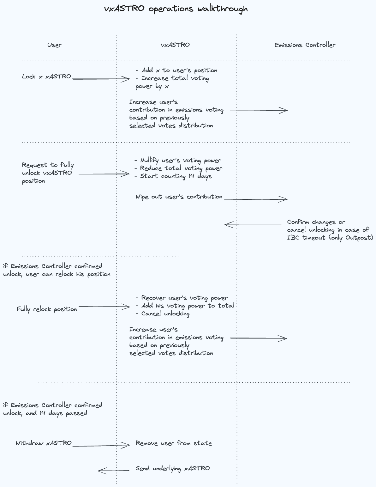

# Vote Escrowed Staked ASTRO (vxASTRO)

The **vxASTRO** contract enables **xASTRO** token holders to stake their tokens and participate in Emissions Voting.

## Features

- **Indefinite Locking:** Tokens are locked indefinitely, with an option for users to request unlocking at any time.
- **Unlocking Period:** The unlocking process takes 14 days.
- **Voting Power:** vxASTRO voting power is always equivalent to the underlying xASTRO share.
- **Governance:** vxASTRO holders retain their voting power in Astroport Governance while their xASTRO is locked.
- **Non-Transferable:** vxASTRO tokens are not transferable.
- **CW20 Queries:** The contract implements several CW20 queries to function like a CW20 token for query purposes,
  useful for wallet views.
- **Emissions Controller Interaction:** The contract interacts with the Emissions Controller whenever a user's balance
  changes, updating the user's contribution in Emissions Voting.

## Usage

vxASTRO allows holders to influence liquidity flows and participate in the governance of the Astroport.

